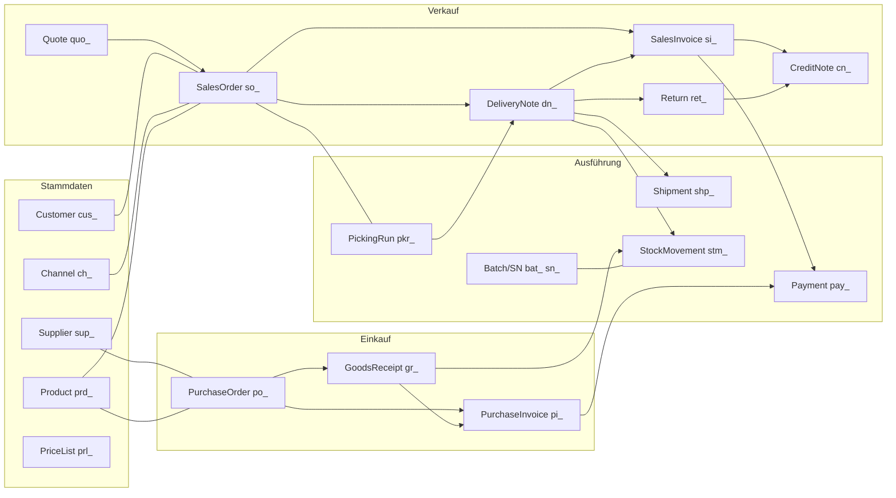

# Zielmodell v0.9 — alle Entities, Payloads, Steps & Actions

> Verbindliche Modell-Referenz für Bau-Agenten. Das Warum steht in `00-decisions.md`.
> JSON-Blöcke enthalten `//`-Kommentare zur Erklärung — im echten API-Output existieren sie nicht.
> Geld = Dezimal-String (ADR-006). Referenzen = `{id, number, name, href}` (ADR-001).

## 1 Prinzipien (Kurzfassung, Details in ADRs)

P1 sprechende ID-Präfixe · P2 Referenz-Objekte · P3 ein Belegskelett · P4 Symmetrie
Lesen/Schreiben (außer berechnet: totals, status, documents, fulfillment, stock) ·
P5 documents-Graph · P6 `?expand=` · P7 Status + `available.steps/actions` ·
P8 Standardtypen (Geld/Menge/ISO).

## 2 Objektmodell



## 3 Listen, Filter & Suche

- Syntax `?filter[pfad][operator]=wert`; Operatoren: eq(default), ne, in, gte, lte,
  between, contains, startsWith, isNull. Jedes skalare Feld + Referenz-ID/-Nummer
  filterbar (generiert, ADR-007). Sortierung: jedes filterbare Feld. Keine versteckten
  Listen-Defaults. `?search=` → number, references.*, Partnername/-nummer, E-Mail, PLZ, Ort.
  Cursor-Pagination, `?count=true` optional.
- **Abnahme-Sichten** (müssen als Query funktionieren):
  1. Offene Posten: `/salesInvoices?filter[status]=open&filter[payment.status][in]=unpaid,partiallyPaid`
  2. Überfällig fürs Mahnwesen: `…filter[payment.dueDate][lt]=today&filter[payment.status][ne]=paid&filter[dunning.blocked]=false`
  3. Versandfertig: `/salesOrders?filter[status]=confirmed&filter[shipping.status]=open&filter[holds][isNull]=true`
  4. Shop-Orders heute je Kanal: `…filter[channel.id]=ch_shopify&filter[createdAt][gte]=…`
  5. Nachschub: `/products?filter[stock.belowMinimum]=true&filter[kind]=physical`
  6. Chargen-Rückruf: `/deliveryNotes?filter[items.batches.batch.number]=CH-2026-07`
  7. Unbestätigte Bestellungen: `/purchaseOrders?filter[status]=sent&filter[confirmation.status]=pending`
  8. 3-Wege-Mismatch: `/purchaseInvoices?filter[match.status]=mismatch`
  9. Retourenquote je Kanal: `/returns?filter[channel.id]=…&filter[dates.issued][between]=…`
  10. Kundenumsatz im Zeitraum: `/salesInvoices?filter[customer.id]=…&filter[dates.issued][between]=…&count=true`

## 4 Verkaufsbelege

Gemeinsames Skelett siehe SalesOrder (4.2). Ab 4.3 werden identische Blöcke
(Adressen, Texte, project/costCenter, currency/exchangeRate, customFields, Timestamps)
nicht wiederholt — sie existieren in jedem Beleg.

### 4.1 quote — Angebot

```jsonc
{
  "object": "quote", "id": "quo_5c1d8e", "number": "AN-2026-0301",
  "status": "sent",                            // draft → sent → accepted | declined | expired | cancelled
  "customer": { "id": "cus_4n8p2q", "number": "K-10023", "name": "Muster GmbH", "href": "/v1/customers/cus_4n8p2q" },
  "channel": { "id": "ch_direct", "name": "Direktvertrieb", "href": "/v1/channels/ch_direct" },
  "project": { "id": "prj_2k5m", "number": "P-2026-12", "name": "Messe-Ausstattung", "href": "/v1/projects/prj_2k5m" },
  "costCenter": "CC-100",
  "references": { "customerInquiryNumber": "ANF-889" },
  "dates": { "issued": "2026-07-10", "validUntil": "2026-08-10", "expectedOrderDate": "2026-07-30", "requestedDelivery": "2026-09-01" },
  "billingAddress": { "name": "Muster GmbH", "street": "Fuggerstraße 11", "zip": "86150", "city": "Augsburg", "country": "DE" },
  "shippingAddress": { "name": "Muster GmbH – Lager", "street": "Industriestraße 5", "zip": "86159", "city": "Augsburg", "country": "DE" },
  "items": [{
    "object": "quoteItem", "id": "itm_q1", "position": 1,
    "product": { "id": "prd_9x1v3b", "number": "SKU-100", "name": "Alu-Flasche 750 ml", "href": "/v1/products/prd_9x1v3b" },
    "description": "Alu-Flasche 750 ml, silber, mit Gravur",
    "quantity": { "value": 500, "unit": "piece" },
    "unitPrice": { "amount": "9.90", "currency": "EUR" },
    "priceSource": "priceList:prl_b2b",
    "discountPercent": 0, "taxRate": "standard",
    "totals": { "net": "4950.00", "tax": "940.50", "gross": "5890.50" },
    "isOptional": false                         // optionale Positionen zählen nicht in totals
  }],
  "currency": "EUR", "exchangeRate": { "rate": "1.0000", "baseCurrency": "EUR" },
  "totals": { "currency": "EUR", "net": "4950.00",
    "taxes": [{ "rate": "standard", "percent": 19, "base": "4950.00", "amount": "940.50" }],
    "gross": "5890.50" },
  "payment": { "method": { "id": "paym_inv", "name": "Rechnung", "href": "/v1/paymentMethods/paym_inv" },
    "terms": { "dueDays": 30, "discountPercent": 2, "discountDays": 10 } },
  "shipping": { "method": { "id": "ship_sped", "name": "Spedition", "href": "/v1/shippingMethods/ship_sped" } },
  "texts": { "intro": "…", "outro": "…" }, "note": null,
  "documents": { "salesOrders": [] },
  "available": { "steps": ["accept", "decline", "cancel"], "actions": ["convertToSalesOrder", "duplicate", "downloadPdf", "sendByEmail"] },
  "customFields": {}, "createdAt": "…", "updatedAt": "…"
}
```

### 4.2 salesOrder — Auftrag (Referenzbeleg)

```jsonc
{
  "object": "salesOrder", "id": "so_7g2k9m", "number": "AB-2026-0815",
  "status": "confirmed",                       // draft → confirmed → fulfilled → closed | cancelled
  "customer": { "id": "cus_4n8p2q", "number": "K-10023", "name": "Muster GmbH", "href": "/v1/customers/cus_4n8p2q" },
  "channel": { "id": "ch_shopify", "name": "Shopify DE", "href": "/v1/channels/ch_shopify" },
  "project": null, "costCenter": null,
  "references": {
    "customerOrderNumber": "PO-4711",           // Bestellnummer des Kunden (B2B)
    "externalId": "gid://shopify/Order/450789", // technische ID im Quellsystem
    "externalNumber": "#1001",
    "paymentTransactionId": "PAYPAL-8XK21…"
  },
  "dates": { "issued": "2026-07-18", "requestedDelivery": "2026-07-25", "confirmedDelivery": null },
  "billingAddress": { "name": "Muster GmbH", "street": "Fuggerstraße 11", "zip": "86150", "city": "Augsburg",
    "country": "DE", "email": "buchhaltung@muster.de", "phone": "+49 821 123456-0", "vatId": "DE123456789" },
  "shippingAddress": { "name": "Muster GmbH – Lager", "street": "Industriestraße 5", "zip": "86159", "city": "Augsburg", "country": "DE" },
  "items": [
    {
      "object": "salesOrderItem", "id": "itm_1a9f", "position": 1,
      "product": { "id": "prd_9x1v3b", "number": "SKU-100", "name": "Alu-Flasche 750 ml", "href": "/v1/products/prd_9x1v3b" },
      "description": "Alu-Flasche 750 ml, silber, mit Gravur",
      "quantity": { "value": 10, "unit": "piece" },
      "unitPrice": { "amount": "12.90", "currency": "EUR" }, "priceSource": "manual",
      "discountPercent": 5, "taxRate": "standard",
      "totals": { "net": "122.55", "tax": "23.28", "gross": "145.83" },
      "warehouse": { "id": "wh_main", "name": "Hauptlager", "href": "/v1/warehouses/wh_main" },
      "fulfillment": { "shipped": 10, "invoiced": 10, "returned": 0, "allocated": 10, "backordered": 0, "expectedDate": null },  // read-only (ATP light)
      "parentItem": null                        // Stücklisten-Kinder referenzieren Eltern-Item
    },
    { "object": "textItem", "id": "itm_2b3c", "position": 2, "style": "heading", "text": "Zubehör" }  // heading | subtotal | pageBreak
  ],
  "discounts": [                                // Kopfrabatte/Gutscheine (E-Commerce)
    { "kind": "voucher", "code": "SOMMER10", "description": "10 % Sommeraktion",
      "amount": { "amount": "12.75", "currency": "EUR" }, "percent": 10 }
  ],
  "currency": "EUR", "exchangeRate": { "rate": "1.0000", "baseCurrency": "EUR" },
  "totals": { "currency": "EUR", "itemsNet": "122.55", "discountNet": "-12.75", "shippingNet": "4.90",
    "net": "114.70", "taxes": [{ "rate": "standard", "percent": 19, "base": "114.70", "amount": "21.79" }],
    "gross": "136.49" },
  "payment": { "method": { "id": "paym_paypal", "name": "PayPal", "href": "/v1/paymentMethods/paym_paypal" },
    "terms": { "dueDays": 0, "discountPercent": 0, "discountDays": 0 }, "status": "paid" },
  "shipping": { "method": { "id": "ship_dhl", "name": "DHL Paket", "href": "/v1/shippingMethods/ship_dhl" },
    "status": "open", "cost": { "amount": "4.90", "currency": "EUR" } },
  "fulfillmentPolicy": { "auto": true, "priority": "normal", "partialShipping": "allowed" },
  "holds": [],                                  // [{type: creditLimit|payment|manual|address|fraud, since, by}]
  "texts": { "intro": "…", "outro": "…" }, "note": "VIP-Kunde, bitte priorisieren.",
  "documents": {
    "quote": { "id": "quo_5c1d8e", "number": "AN-2026-0301", "href": "/v1/quotes/quo_5c1d8e" },
    "deliveryNotes": [{ "id": "dn_2h6j4l", "number": "LS-2026-0733", "href": "/v1/deliveryNotes/dn_2h6j4l" }],
    "salesInvoices": [{ "id": "si_8m3t7k", "number": "RE-2026-1042", "href": "/v1/salesInvoices/si_8m3t7k" }],
    "returns": []
  },
  "available": { "steps": ["close", "cancel"],
    "actions": ["createDeliveryNote", "createSalesInvoice", "createPickingRun", "addHold", "duplicate", "downloadPdf"] },
  "customFields": { "campaign": "summer26" }, "createdAt": "…", "updatedAt": "…"
}
```

### 4.3 deliveryNote — Lieferschein

```jsonc
{
  "object": "deliveryNote", "id": "dn_2h6j4l", "number": "LS-2026-0733",
  "status": "shipped",                          // draft → picking → shipped → delivered | cancelled
  "customer": { "…": "Referenz" }, "channel": { "…": "Referenz" },
  "references": { "customerOrderNumber": "PO-4711" },
  "dates": { "issued": "2026-07-19", "shipped": "2026-07-19", "delivered": null },
  "warehouse": { "id": "wh_main", "…": "Default, je Item überschreibbar" },
  "items": [{
    "object": "deliveryNoteItem", "id": "itm_9r4t", "position": 1,
    "orderItem": { "id": "itm_1a9f", "href": "/v1/salesOrders/so_7g2k9m/items/itm_1a9f" },
    "product": { "…": "Referenz" },
    "quantity": { "value": 10, "unit": "piece" },
    "warehouse": { "…": "Referenz" },
    "batches": [{ "batch": { "id": "bat_5w2r", "number": "CH-2026-07", "href": "/v1/batches/bat_5w2r" }, "quantity": 10 }],
    "serialNumbers": []
  }],
  "shipments": [{ "id": "shp_6v2n8c", "number": "00340434161234567890", "name": "DHL Paket · in Zustellung", "href": "/v1/shipments/shp_6v2n8c" }],
  "customs": { "totalWeight": { "value": 2.1, "unit": "kg" }, "incoterm": "DAP", "note": null },   // nur bei Export
  "documents": { "salesOrder": { "…": "Ref" }, "salesInvoices": ["…"], "returns": [] },
  "available": { "steps": ["markDelivered", "cancel"], "actions": ["createShipment", "createReturn", "createSalesInvoice", "downloadPdf", "printLabels"] }
}
```

### 4.4 salesInvoice — Ausgangsrechnung

```jsonc
{
  "object": "salesInvoice", "id": "si_8m3t7k", "number": "RE-2026-1042",
  "status": "open",                             // draft → open → paid | cancelled · issue = Festschreibung (ADR-009)
  "fixedAt": "2026-07-19T10:00:01Z",
  "customer": { "…": "Ref" }, "channel": { "…": "Ref" }, "project": null, "costCenter": "CC-100",
  "references": { "customerOrderNumber": "PO-4711", "debtorAccountNumber": "10023" },
  "dates": { "issued": "2026-07-19", "serviceDate": "2026-07-19", "servicePeriod": null },   // §14 UStG
  "taxation": "domestic",                       // domestic | euB2B (reverse charge) | euOss | export
  "items": [{
    "object": "salesInvoiceItem", "id": "itm_7q2w", "position": 1,
    "orderItem": { "…": "Ref" }, "product": { "…": "Ref" },
    "quantity": { "value": 10, "unit": "piece" },
    "unitPrice": { "amount": "12.90", "currency": "EUR" },
    "discountPercent": 5, "taxRate": "standard",
    "totals": { "net": "122.55", "tax": "23.28", "gross": "145.83" }
  }],
  "currency": "EUR", "exchangeRate": { "rate": "1.0000", "baseCurrency": "EUR" },
  "totals": { "currency": "EUR", "itemsNet": "122.55", "shippingNet": "4.90", "net": "127.45",
    "taxes": [{ "rate": "standard", "percent": 19, "base": "127.45", "amount": "24.22" }],
    "gross": "151.67", "paid": "100.00", "outstanding": "51.67" },
  "payment": { "method": { "…": "Ref" }, "terms": { "dueDays": 30, "discountPercent": 2, "discountDays": 10 },
    "dueDate": "2026-08-18", "discountDate": "2026-07-29", "status": "partiallyPaid",
    "payments": [{ "id": "pay_3c7x1f", "number": "Z-2026-0451", "name": "Zahlung 100,00 EUR vom 20.07.2026", "href": "/v1/payments/pay_3c7x1f" }] },
  "dunning": { "level": 0, "blocked": false, "lastReminderAt": null, "note": null },
  "eInvoice": { "format": "zugferd",            // none | zugferd | xrechnung | peppol
    "status": "generated", "buyerReference": "04011000-12345-67", "downloadUrl": "/v1/salesInvoices/si_8m3t7k/eInvoice" },
  "documents": { "salesOrder": { "…": "Ref" }, "deliveryNotes": ["…"], "creditNotes": [] },
  "available": { "steps": ["cancel"], "actions": ["send", "registerPayment", "remind", "createCreditNote", "downloadPdf", "downloadEInvoice"] }
}
```

### 4.5 creditNote — Gutschrift

```jsonc
{
  "object": "creditNote", "id": "cn_4d9h2s", "number": "GS-2026-0088",
  "status": "open",                             // draft → open → settled | cancelled
  "kind": "correction",                         // correction | cancellation (Storno-Beleg)
  "customer": { "…": "Ref" },
  "dates": { "issued": "2026-07-28", "serviceDate": "2026-07-19" }, "taxation": "domestic",
  "items": [{ "object": "creditNoteItem", "invoiceItem": { "…": "Ref" }, "product": { "…": "Ref" },
    "quantity": { "value": 2, "unit": "piece" }, "unitPrice": { "amount": "12.90", "currency": "EUR" },
    "discountPercent": 5, "taxRate": "standard", "totals": { "net": "24.51", "tax": "4.66", "gross": "29.17" } }],
  "totals": { "currency": "EUR", "net": "24.51", "taxes": ["…"], "gross": "29.17", "settled": "0.00", "outstanding": "29.17" },
  "settlement": { "mode": "refund",             // refund | offset (mit Rechnung verrechnen)
    "status": "open", "payments": [] },
  "documents": { "salesInvoice": { "…": "Ref" }, "return": { "…": "Ref" } },
  "available": { "steps": ["cancel"], "actions": ["send", "registerRefund", "offsetAgainstInvoice"] }
}
```

### 4.6 return — Retoure

```jsonc
{
  "object": "return", "id": "ret_1f6b9d", "number": "RT-2026-0102",
  "status": "checked",                          // requested → received → checked → settled | cancelled
  "customer": { "…": "Ref" }, "channel": { "…": "Ref" },
  "references": { "rmaNumber": "RMA-2026-0102", "customerOrderNumber": "PO-4711" },
  "dates": { "requested": "2026-07-24", "received": "2026-07-27", "settled": null },
  "warehouse": { "id": "wh_returns", "…": "Retourenlager" },
  "items": [{
    "object": "returnItem", "deliveryNoteItem": { "…": "Ref" }, "product": { "…": "Ref" },
    "quantity": { "value": 2, "unit": "piece" },
    "reason": { "id": "rsn_damaged", "name": "Beschädigt", "href": "/v1/returnReasons/rsn_damaged" },
    "condition": "damaged",                     // resellable | damaged | disposal
    "action": "credit",                         // credit | replace | repair
    "receivedQuantity": 2, "creditedQuantity": 2
  }],
  "resolution": { "creditNote": { "…": "Ref" }, "replacementOrder": null },
  "documents": { "salesOrder": { "…": "Ref" }, "deliveryNote": { "…": "Ref" } },
  "available": { "steps": ["settle", "cancel"], "actions": ["sendReturnLabel", "createCreditNote", "createReplacementOrder", "restock"] }
}
```

## 5 Einkaufsbelege

### 5.1 purchaseOrder — Bestellung

```jsonc
{
  "object": "purchaseOrder", "id": "po_3z8c5v", "number": "BE-2026-0450",
  "status": "confirmed",                        // draft → sent → confirmed → received → closed | cancelled
  "supplier": { "id": "sup_3f8k1z", "number": "L-2001", "name": "Alu Trading Ltd.", "href": "/v1/suppliers/sup_3f8k1z" },
  "references": { "ourCustomerNumber": "CUST-88231", "supplierOfferNumber": "AT-Q-5521" },
  "dates": { "issued": "2026-07-01", "requestedDelivery": "2026-07-20", "confirmedDelivery": "2026-07-22" },
  "confirmation": { "status": "confirmed",      // pending | confirmed | deviating
    "supplierOrderNumber": "AT-SO-99120", "confirmedAt": "2026-07-03", "via": "email" },
  "deliveryAddress": { "…": "…" }, "warehouse": { "…": "Ref" },
  "items": [{
    "object": "purchaseOrderItem", "product": { "…": "Ref" },
    "supplierProductNumber": "AT-750-SLV", "supplierProductName": "Alu Bottle 750 silver",
    "quantity": { "value": 1000, "unit": "piece" }, "unitPrice": { "amount": "6.20", "currency": "EUR" },
    "taxRate": "standard", "totals": { "net": "6200.00", "tax": "1178.00", "gross": "7378.00" },
    "fulfillment": { "received": 500, "invoiced": 500 }
  }],
  "totals": { "…": "wie Skelett" },
  "payment": { "method": { "…": "Ref" }, "terms": { "dueDays": 45, "discountPercent": 3, "discountDays": 14 } },
  "printSettings": { "withoutPrices": false, "requestConfirmation": true },
  "documents": { "goodsReceipts": ["…"], "purchaseInvoices": ["…"] },
  "available": { "steps": ["close", "cancel"], "actions": ["send", "recordConfirmation", "createGoodsReceipt", "requestConfirmation", "downloadPdf"] },
  "dropship": null                              // { salesOrder: Ref, deliveryAddress: Kundenadresse } (Strecke)
}
```

### 5.2 goodsReceipt — Wareneingang

```jsonc
{
  "object": "goodsReceipt", "id": "gr_1a2b", "number": "WE-2026-0210",
  "status": "posted",                           // draft → post → posted | cancelled
  "supplier": { "…": "Ref" }, "warehouse": { "…": "Ref" },
  "references": { "supplierDeliveryNoteNumber": "AT-LS-7712" },
  "dates": { "received": "2026-07-14", "posted": "2026-07-14" },
  "items": [{
    "object": "goodsReceiptItem", "purchaseOrderItem": { "…": "Ref" }, "product": { "…": "Ref" },
    "quantity": { "value": 500, "unit": "piece" },
    "storageLocation": { "id": "loc_A-03-2", "name": "A-03-2", "href": "…" },
    "batches": [{ "batch": { "…": "Ref" }, "quantity": 500, "bestBefore": "2028-06-30" }],
    "serialNumbers": [],
    "qualityCheck": { "status": "passed", "note": null }   // passed | failed | pending
  }],
  "documents": { "purchaseOrder": { "…": "Ref" }, "purchaseInvoices": ["…"], "stockMovements": ["…"] },
  "available": { "steps": ["cancel"], "actions": ["proposeStorageLocations", "printProductLabels", "printBatchLabels"] }
}
```

### 5.3 purchaseInvoice — Eingangsrechnung

```jsonc
{
  "object": "purchaseInvoice", "id": "pi_7k3m9x", "number": "ER-2026-0331",
  "status": "approved",                         // received → matched → approved → paid | rejected
  "supplier": { "…": "Ref" }, "costCenter": "CC-200",
  "references": { "supplierInvoiceNumber": "AT-INV-20441",   // Pflicht: Nummer DES LIEFERANTEN
    "creditorAccountNumber": "70201" },
  "dates": { "invoiceDate": "2026-07-15", "received": "2026-07-16", "serviceDate": "2026-07-14" },
  "items": [{ "purchaseOrderItem": { "…": "Ref" }, "product": { "…": "Ref" },
    "quantity": { "value": 500, "unit": "piece" }, "unitPrice": { "amount": "6.20", "currency": "EUR" },
    "taxRate": "standard", "totals": { "net": "3100.00", "tax": "589.00", "gross": "3689.00" } }],
  "totals": { "…": "+ paid / outstanding" },
  "match": { "status": "matched",               // pending | matched | mismatch — 3-Wege-Abgleich
    "deviations": [],                           // [{type: price|quantity, item, expected, actual}]
    "purchaseOrder": { "…": "Ref" }, "goodsReceipts": ["…"] },
  "approval": { "status": "approved", "by": { "…": "usr-Ref" }, "at": "…" },
  "payment": { "…": "+ dueDate/discountDate/status/payments" },
  "files": [{ "id": "fil_5t8u", "name": "AT-INV-20441.pdf", "downloadUrl": "…" }],   // Original-Beleg
  "available": { "steps": ["approve", "reject"], "actions": ["rematch", "registerPayment", "schedulePayment", "attachFile"] }
}
```

## 6 Stammdaten

### 6.1 customer

```jsonc
{
  "object": "customer", "id": "cus_4n8p2q", "number": "K-10023",
  "status": "active", "type": "company", "name": "Muster GmbH",
  "email": "info@muster.de", "phone": "…", "website": "…", "vatId": "DE123456789",
  "parent": null,                               // Filiale → Zentrale (B2B-Hierarchie)
  "billTo": null,                               // Zentralregulierung: Rechnung an Verband/Zentrale
  // ONE unified address list (same field names the document snapshots use:
  // name/street/zip/city/state/country/email/phone). The main address is just the
  // DEFAULT row of this list — a `type: both` entry (id "adr_main", isDefault) —
  // NOT a separate `primaryAddress` block (that Xentral redundancy is hidden inside
  // the core). `type` = billing | shipping | both; `label` names the location.
  // Filterable/sortable/searchable on street/zip/city/state/country.
  // PATCH semantics = the FULL desired set (tags precedent): entries without id are
  // created, with id updated, missing ones deleted.
  // Upstream (PRIO 2, invisible outward): the default both/billing row ↔ v3
  // primaryAddress; a deviating billing row ↔ v3 deviatingBillingAddress (singleton);
  // every shipping row ↔ v3 {partner}/deliveryAddresses (CRUD, both partners).
  // WISHES (no v3 field yet — see priorities.json): `isDefault`, `label`, and the
  // `both` type value.
  "addresses": [{ "id": "adr_main", "type": "both", "label": "Hauptadresse", "isDefault": true, "name": "Muster GmbH", "street": "Fuggerstr. 11", "zip": "86150", "city": "Augsburg", "state": "BY", "country": "DE", "email": "…", "phone": "…" },
                { "id": "adr_s2", "type": "shipping", "label": "Lager München", "name": "Muster GmbH – Lager", "street": "Industriestr. 5", "zip": "86159", "city": "München", "country": "DE", "gln": "…", "email": "…", "phone": "…" }],
  // Ansprechpartner — own list, NOT mixed into addresses; in v3 a separate
  // sub-resource {partner}/contactPersons (CRUD, both partners); role ← upstream
  // `department`. Same full-set PATCH semantics.
  "contacts": [{ "id": "con_1", "type": "mrs", "name": "Erika Beispiel", "title": "Dr.", "position": "Leiterin", "department": "Einkauf", "subDepartment": null, "email": "…", "phone": "…", "mobile": "…", "remarks": "…", "internalNote": null }],
  "defaults": { "currency": "EUR", "language": "de",
    "paymentMethod": { "…": "Ref" }, "paymentTerms": { "dueDays": 30, "discountPercent": 2, "discountDays": 10 },
    "shippingMethod": { "…": "Ref" }, "priceList": { "…": "Ref" },
    "taxation": "domestic", "partialShipping": "allowed" },
  "finance": {                                  // read-only
    "openAmount": { "amount": "1240.00", "currency": "EUR" },
    "creditLimit": { "amount": "5000.00", "currency": "EUR" },
    "overdueAmount": { "amount": "0.00", "currency": "EUR" },
    "onHold": false, "dunningBlocked": false },
  "channels": [{ "channel": { "…": "Ref" }, "externalId": "cust-7781" }],
  "tags": ["b2b", "vip"], "customFields": {}
}
```

### 6.2 supplier — strukturgleich zu customer, plus:

```jsonc
{
  "defaults": { "…": "+ deliveryDays: 14, minimumOrderValue: {…}" },
  "purchasing": { "ourCustomerNumber": "CUST-88231", "confirmationRequired": true, "sendOrdersVia": "email" },
  "finance": { "openAmount": { "…": "…" }, "creditorAccountNumber": "70201" }
}
```

### 6.3 product

Konsolidiert aus v3-Read-API (PR API-710, ~100 Felder, 33 Includes). Flag→Enum siehe ADR-011.

```jsonc
{
  "object": "product", "id": "prd_9x1v3b", "number": "SKU-100",
  "status": "active", "statusReason": null,     // active | inactive | archived
  "kind": "physical",                           // physical | service | digital | shippingCost | fee
  "name": "Alu-Flasche 750 ml", "description": "…", "unit": "piece",
  "category": { "id": "cat_bottles", "name": "Flaschen", "href": "…" }, "project": null, "tags": ["bottles"],
  "identifiers": { "ean": "4001234567890", "manufacturerNumber": "ALB-750-S",
    "hsCode": "76129080", "countryOfOrigin": "DE",
    "external": [{ "channel": { "…": "Ref" }, "id": "gid://shopify/Product/84512" }] },
  "manufacturer": { "name": "AluBottle Inc.", "website": "…" },
  "prices": { "sale": { "amount": "12.90", "currency": "EUR" },
    "purchase": { "amount": "6.20", "currency": "EUR", "source": "calculated" } },   // manual | calculated
  "tax": { "rate": "standard", "profile": null },   // profile → taxProfile (Konten-Matrix)
  "logistics": { "weight": { "value": 0.18, "unit": "kg" }, "netWeight": { "…": "…" },
    "dimensions": { "length": 8, "width": 8, "height": 26, "unit": "cm" },
    "minimumOrderQuantity": 1, "minimumStockQuantity": 50,
    "packagingUnits": [{ "unit": "carton", "quantity": 24, "ean": "…" }] },
  "tracking": { "stock": true, "batches": true, "serialNumbers": "none", "bestBefore": true },  // none|onReceipt|onDelivery
  "stock": { "available": 240, "reserved": 25, "incoming": 500, "belowMinimum": false,   // read-only
    "byWarehouse": [{ "warehouse": { "…": "Ref" }, "available": 240, "reserved": 25 }] },
  "production": { "mode": "none", "hasBillOfMaterials": false },   // none|inHouse|external|justInTime
  "documentDefaults": { "hidePrice": false, "noticeText": null, "requiresCustomerApproval": false },  // ADR-012!
  "variant": { "of": null, "attributes": {}, "isMatrix": false },
  "bom": { "items": [{ "product": { "…": "Ref" }, "quantity": 1 }] },   // bei hasBillOfMaterials
  "suppliers": [{ "supplier": { "…": "Ref" }, "supplierProductNumber": "AT-750-SLV",
    "purchasePrice": { "…": "…" }, "deliveryDays": 14, "isDefault": true }],
  "customFields": {}
}
```

Includes: texts (Sprachen), media, priceLists, shopCategories, batches/serialNumbers/
bestBeforeDates, storageLocations, warehouseMinimums, reservations, bom.parts/bom.usedIn,
workInstructions, calculation, channels, crossSelling, certificates/rawMaterials/properties.
Expert-Includes (nicht Kern): formulas, commissions, functionProtocols, deliveryThresholds.

### 6.4 channel

```jsonc
{
  "object": "channel", "id": "ch_shopify", "name": "Shopify DE", "status": "active",
  "platform": "shopify",                        // shopify | shopware | amazon | ebay | otto | pos | direct | api
  "defaults": { "priceList": { "…": "Ref" }, "warehouse": { "…": "Ref" },
    "paymentMethod": { "…": "Ref" }, "project": null, "autoFulfill": true },
  "sync": { "orders": { "lastRunAt": "…", "status": "ok" }, "stock": { "lastRunAt": "…", "status": "ok" } }  // read-only
}
```

### 6.5 priceList

```jsonc
{
  "object": "priceList", "id": "prl_b2b", "name": "B2B Händler", "status": "active",
  "currency": "EUR", "validFrom": "2026-01-01", "validUntil": null,
  "entries": [{ "id": "ple_1", "product": { "…": "Ref" },
    "tiers": [{ "minQuantity": 1, "unitPrice": { "amount": "11.90", "currency": "EUR" } },
              { "minQuantity": 50, "unitPrice": { "amount": "9.90", "currency": "EUR" } }] }]
}
```
Preisauflösung (ADR-012): Item-Preis > Kundenpreisliste > Kanalpreisliste > Produkt-Basispreis;
Ergebnis am Item als `priceSource`.

### 6.6 Konfig-Objekte (kompakt)

```jsonc
{
  "warehouse":      { "id": "wh_main", "name": "Hauptlager", "status": "active",
                      "kind": "internal",       // internal | external | fba | consignment
                      "address": { "…": "…" } },
  "paymentMethod":  { "id": "paym_inv", "name": "Rechnung", "kind": "invoice",   // invoice|prepaid|directDebit|psp|cash
                      "defaultTerms": { "dueDays": 30, "discountPercent": 2, "discountDays": 10 } },
  "shippingMethod": { "id": "ship_dhl", "name": "DHL Paket", "carrier": "dhl",
                      "trackingUrlTemplate": "https://www.dhl.de/…/{trackingNumber}" },
  "taxProfile":     { "id": "taxp_std", "name": "Standard DE",
                      "accounts": { "revenueDomestic": "8400", "revenueEu": "8125", "revenueExport": "8120",
                                    "expenseDomestic": "3400", "expenseEu": "3425", "expenseImport": "3559" } },
  "project":        { "id": "prj_2k5m", "number": "P-2026-12", "name": "Messe-Ausstattung", "status": "active" },
  "user":           { "id": "usr_9k2f", "name": "B. Sauter", "email": "…", "status": "active" },
  "category":       { "id": "cat_bottles", "name": "Flaschen", "parent": null },
  "returnReason":   { "id": "rsn_damaged", "name": "Beschädigt", "requiresPhoto": true },
  "stockMovementReason": { "id": "smr_stocktaking", "name": "Inventurdifferenz", "appliesTo": ["correction"] }
}
```

## 7 Ausführung

### 7.1 shipment

```jsonc
{
  "object": "shipment", "id": "shp_6v2n8c",
  "status": "inTransit",                        // label → handedOver → inTransit → delivered | exception | returned
  "carrier": "dhl", "service": "paket",
  "trackingNumber": "00340434161234567890", "trackingUrl": "…", "labelUrl": "…",
  "weight": { "value": 2.1, "unit": "kg" },
  "packages": [{ "id": "pkg_1", "sscc": "340123450000000018", "weight": { "…": "…" }, "dimensions": { "…": "…" } }],
  "events": [{ "at": "…", "status": "handedOver", "location": "Augsburg" }],   // read-only Carrier-Events
  "documents": { "deliveryNote": { "…": "Ref" } },
  "available": { "steps": [], "actions": ["cancelLabel", "downloadLabel", "refreshTracking"] }
}
```

### 7.2 payment (keine Steps — unveränderlicher Datensatz)

```jsonc
{
  "object": "payment", "id": "pay_3c7x1f", "number": "Z-2026-0451",
  "direction": "incoming",                      // incoming | outgoing
  "date": "2026-07-20", "amount": { "amount": "245.83", "currency": "EUR" },
  "method": { "…": "Ref" }, "party": { "…": "cus/sup-Ref" },
  "reference": "RE-2026-1042, RE-2026-1043",    // Verwendungszweck
  "fees": null,                                  // PSP-Gebühren (→ payout)
  "allocations": [                               // 1 Zahlung → n Rechnungen
    { "invoice": { "…": "si-Ref" }, "amount": "145.83" },
    { "invoice": { "…": "si-Ref" }, "amount": "100.00" }],
  "unallocated": "0.00",
  "available": { "steps": [], "actions": ["allocate", "unallocate", "refund"] }
}
```

### 7.3 batch & serialNumber

```jsonc
{
  "object": "batch", "id": "bat_5w2r", "number": "CH-2026-07",
  "product": { "…": "Ref" }, "bestBefore": "2028-06-30",
  "status": "released",                         // released | blocked
  "stock": { "available": 120, "reserved": 10 },
  "trace": { "goodsReceipts": ["…"], "deliveryNotes": ["…"] }
}
```
`serialNumber` (sn_) strukturgleich: number, product, status (inStock|delivered|returned),
trace + `customer`-Referenz nach Auslieferung (Garantie).

### 7.4 stockMovement (append-only; ADR-010)

```jsonc
{
  "object": "stockMovement", "id": "stm_9q1w2e", "number": "LB-2026-8812",
  "type": "receipt",                            // receipt | issue | transfer | correction
  "date": "…", "product": { "…": "Ref" }, "quantity": { "value": 500, "unit": "piece" },
  "from": null,
  "to": { "warehouse": { "…": "Ref" }, "storageLocation": { "…": "Ref" } },
  "batch": { "…": "Ref" },
  "unitCost": { "amount": "6.20", "currency": "EUR" },   // read-only, Bewertung (ADR-009e)
  "source": { "document": { "…": "gr-Ref" }, "user": { "…": "Ref" }, "reason": null }
}
```
Schreiben: `POST /v1/stockMovements` — receipt/issue/transfer mit from/to;
correction mit `quantity` (Delta) ODER `setQuantityTo` (absolut, Inventur) + Pflicht-reason.
Batch inline anlegbar: `"batch": {"new": {"number", "bestBefore"}}`.

### 7.5 storageLocation & stockLevel

```jsonc
{
  "object": "storageLocation", "id": "loc_A-03-2", "name": "A-03-2",
  "status": "active",                           // active | blocked
  "warehouse": { "…": "Ref" },
  // Fünf UNABHÄNGIGE Nutzungen — ein Platz kann Nachschubplatz UND gesperrt sein.
  // Xentrals eigene Namen (Nachschublager, Verbrauchslager, Sperrlager,
  // Fertigungszugriff, Kassenplatz) hier so benannt, wie ein Berater danach fragt.
  "usage": { "replenishment": true, "consumption": false, "blocked": false,
             "production": false, "pointOfSale": false },
  "abcCategory": "A",                           // A | B | C — Kommissionierpriorität
  "pickingOrder": 312,                          // Laufweg-Sortierung (upstream `sort`)
  "dimensions": { "length": 100, "width": 60, "height": 40 },   // kein Gewichtslimit upstream
  "description": "Nachschubzone A",             // read-only: upstream lehnt Schreiben ab
  "contents": [{ "product": { "…": "Ref" }, "batch": { "…": "Ref" },
    "quantity": { "value": 118, "unit": "piece" }, "reserved": { "value": 10, "unit": "piece" } }]   // read-only
}
```
`stockLevel` = read-only Projektion Produkt × Platz × Charge mit quantity/reserved/available;
`GET /v1/stockLevels?filter[product|warehouse|storageLocation|batch]…` ist DIE Bestands-Query.

### 7.6 pickingRun — Kommissionierung

```jsonc
{
  "object": "pickingRun", "id": "pkr_5f8w2n", "number": "KO-2026-0512",
  "status": "inProgress",                       // draft → released → inProgress → picked → completed | cancelled
  "strategy": "wave",                           // single | multiOrder | wave | zone
  "warehouse": { "…": "Ref" }, "assignedTo": [{ "…": "usr-Ref" }],
  "criteria": { "channel": { "…": "Ref" }, "shippingMethod": { "…": "Ref" },
    "orderedBefore": "2026-07-18T12:00:00Z", "onlyFullyAllocatable": true, "maxOrders": 40 },
  "orders": ["…so-Refs…"],
  "containers": [{ "id": "tote_12", "name": "Wanne 12", "barcode": "TOTE-000012", "salesOrder": { "…": "Ref" } }],
  "tasks": [{
    "object": "pickTask", "id": "pkt_a1", "position": 1,
    "status": "picked",                         // open → picked | short | skipped
    "zone": "A",
    "storageLocation": { "…": "Ref" }, "product": { "…": "Ref" }, "batch": { "…": "Ref" },
    "quantity": { "value": 10, "unit": "piece" },
    "container": { "id": "tote_12", "name": "Wanne 12" },
    "for": { "orderItem": { "…": "Ref" } },
    "verification": { "scanLocation": true, "scanProduct": true, "scanContainer": true },
    "picked": { "quantity": { "…": "…" }, "by": { "…": "Ref" }, "at": "…", "scans": ["LOC:A-03-2", "EAN:…", "TOTE-000012"] },
    "shortReason": null
  }],
  "progress": { "tasks": 96, "picked": 61, "short": 1, "open": 34 },
  "documents": { "deliveryNotes": [] },
  "available": { "steps": ["pause", "complete", "cancel"], "actions": ["assign", "reprioritize", "printPickList"] }
}
```
Task-Bestätigung: `POST …/tasks/{id}/pick {quantity, scans[], batch?}` (idempotent, offline-fähig).
`complete`: erzeugt je Auftrag/Behälter den Lieferschein, bucht issue-Movements mit Task
als source, meldet Fehlmengen als `fulfillment.backordered` an den Auftrag.

### 7.7 stockTake — Inventur (GoBD)

```jsonc
{
  "object": "stockTake", "id": "stk_2026main", "number": "INV-2026-01",
  "status": "posted",                           // draft → counting → review → posted | cancelled
  "warehouse": { "…": "Ref" }, "scope": { "storageLocations": "all", "products": "all" },
  "dates": { "keyDate": "2026-12-31", "started": "…", "posted": "…" },
  "positions": [{ "id": "stp_1", "storageLocation": { "…": "Ref" }, "product": { "…": "Ref" }, "batch": { "…": "Ref" },
    "expected": { "value": 120, "unit": "piece" }, "counted": { "value": 118, "unit": "piece" },
    "countedBy": { "…": "usr-Ref" }, "difference": { "value": -2, "unit": "piece" },
    "differenceValue": { "amount": "-12.40", "currency": "EUR" } }],
  "totals": { "positions": 1842, "differences": 37, "differenceValue": { "amount": "-486.20", "currency": "EUR" } },
  "documents": { "stockMovements": ["…"] },
  "available": { "steps": ["submit", "post", "cancel"], "actions": ["exportCountingList", "recount", "addPosition"] }
}
```

## 8 Steps & Actions je Entity (Übersicht)

| Entity | Steps (Status-Kette) | Actions |
|---|---|---|
| quote | draft →send→ sent →accept/decline→ accepted/declined \| expire(auto) \| cancel | convertToSalesOrder, duplicate, downloadPdf, sendByEmail |
| salesOrder | draft →confirm→ confirmed →(auto)→ fulfilled →close→ closed \| cancel | createDeliveryNote(items?), createSalesInvoice(items?), createPickingRun, addHold, releaseHold, allocateStock, split, duplicate, downloadPdf, sendConfirmation |
| deliveryNote | draft →startPicking→ picking →(shipment)→ shipped →markDelivered→ delivered \| cancel | createShipment, createReturn, createSalesInvoice, downloadPdf, printLabels |
| salesInvoice | draft →issue(=Festschreibung!)→ open →(payment)→ paid \| cancel(→Storno) | send(email\|eInvoice\|peppol), registerPayment, remind, createCreditNote, writeOff, downloadPdf, downloadEInvoice |
| creditNote | draft →issue→ open →(settlement)→ settled \| cancel | send, registerRefund, offsetAgainstInvoice |
| return | requested →receive→ received →check→ checked →settle→ settled \| cancel | sendReturnLabel, createCreditNote, createReplacementOrder, restock, downloadPdf |
| purchaseOrder | draft →send→ sent →recordConfirmation→ confirmed →(auto)→ received →close→ closed \| cancel | createGoodsReceipt, createPurchaseInvoice, requestConfirmation, updateDeliveryDates, downloadPdf |
| goodsReceipt | draft →post→ posted \| cancel | proposeStorageLocations, printProductLabels, printBatchLabels |
| purchaseInvoice | received →(auto)→ matched →approve→ approved →(payment)→ paid \| reject | rematch, registerPayment, schedulePayment, attachFile |
| pickingRun | draft →release→ released →start→ inProgress →(tasks)→ picked →complete→ completed \| cancel \| pause/resume | assign, pick(task), reportShort(task), reprioritize, printPickList |
| shipment | label →(carrier)→ handedOver → inTransit → delivered \| exception \| returned | createLabel, cancelLabel, downloadLabel, refreshTracking |
| payment | — (keine Steps) | allocate, unallocate, refund |
| stockTake | draft →startCounting→ counting →submit→ review →post→ posted \| cancel | exportCountingList, recount, addPosition |
| stockMovement | — (append-only) | — |
| batch/serialNumber | released ↔block/release↔ blocked | traceReport |
| product | active ↔deactivate/activate↔ inactive →archive→ archived | adjustStock, duplicate, recalculatePurchasePrice, syncToChannel, mergeInto |
| customer/supplier | active →archive→ archived \| reactivate | setHold/releaseHold, mergeInto, runCreditCheck, statement |
| channel | active ↔pause/resume↔ paused | syncOrders, syncStock, syncProducts, testConnection |
| priceList | active ↔deactivate/activate↔ inactive | duplicate(validFrom), bulkAdjust(percent) |
| storageLocation | active ↔block/release↔ blocked | printLabel, requestCount |

## 9 Geplante Erweiterungen (designt, siehe Artefakt Kap. 12)

- **GoBD:** numberRange (nr_) mit Lückenprotokoll, globaler AuditLog, accountingExport (acc_,
  DATEV-Lauf mit exportedAt-Sperre), PDF-Versionsarchiv je Beleg.
- **Multi-Channel:** payout (pot_, PSP-/Marktplatz-Settlement mit Gebühren/Chargebacks),
  OSS-Steuerform `tax: {category, country, percent}` am Item, Events/Webhooks (evt_/whk_).
- **B2B:** blanket orders (salesOrder.kind), Multi-Company (com_, ADR-016).
- **Phase 2:** productionOrder (prod_), letterhead-expand (Beispiel-Payload im
  Feldmatrix-Artefakt bzw. Modell-Artefakt Kap. „include=letterhead“).
