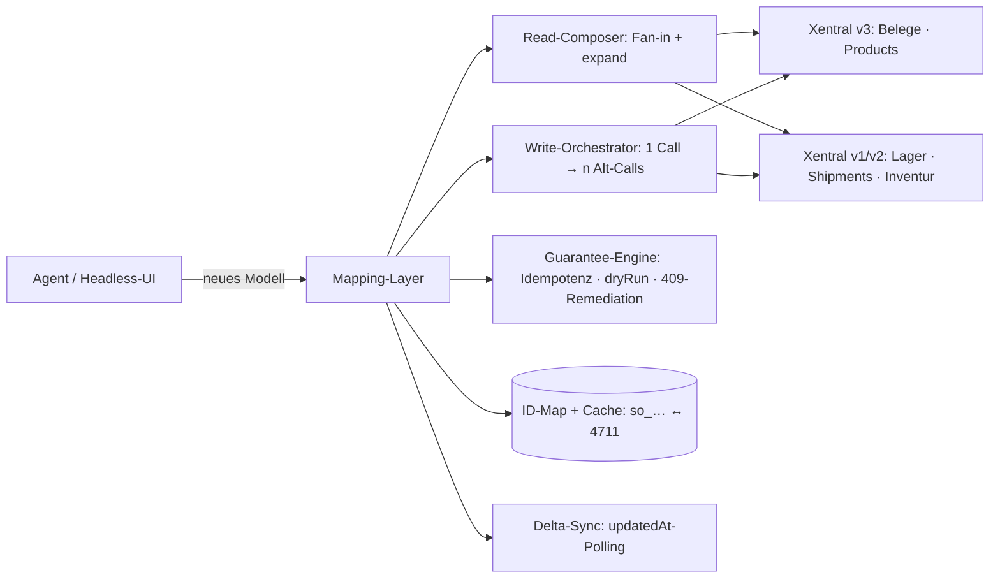

# Mapping-Layer („virtueller Kern“) — neues Modell auf heutiger Xentral-API

> Bauplan für den Zwischenlayer, der nach außen ausschließlich das Zielmodell (01-model.md)
> spricht und intern die heutige Xentral-API (v3 + v1/v2) bedient. Quellenlage siehe
> 02-ist-analyse.md; fehlende Alt-APIs siehe 05-fehlende-apis.csv.

## 1 Architektur

- **ID-Map:** neue IDs deterministisch = Präfix + Kodierung der numerischen Alt-ID
  (kein Lookup); persistente Map nur für Layer-eigene Objekte (Overlay, pkr_, pay_).
  `number`-Lookups via Alt-Filter (`?filter[documentNumber]=`).
- **Read-Composer:** komponiert neue Payloads aus Beleg + Includes + Nachlade-GETs für
  Referenz-Belegnummern; Referenz-Cache `{id → number,name}` mit updatedAt-Invalidierung.
- **Guarantee-Engine (erzwingt, was Alt nicht kann):** Idempotency-Store, `?dryRun=true`
  (lokale Precondition-Prüfung), 409-Remediation (Alt-Fehler → codes+resolution),
  Status-Mapping Alt→Neu, **status-Filter im Alt-Call immer explizit auf „alle“ setzen**
  (Alt-Defaults verstecken Drafts!), Berechnungs-Schicht (Steuer je Satz, outstanding,
  fulfillment-Zähler) mit dokumentierter Rundungsregel (offen, s. u.).

## 2 Mapping je Entity (Lesen / Schreiben / Deckung)

| Neues Objekt | Lesen aus | Schreiben über | Deckung |
|---|---|---|---|
| salesOrder | v3 salesOrders (+Includes); Referenz-Nummern per Nachlade-GET; Ampeln→holds; Status-Map released/sent→confirmed | v3 POST/PATCH (Beta) + Actions (release→confirm …) | Lesen gut · Schreiben dünn (Backlog!) |
| quote | v3 offers (validUntil, customerReference, desiredDelivery ✓) | v3 + Actions | gut · isOptional fehlt |
| salesInvoice | v3 invoices (dunning*, paymentStatus); outstanding berechnet | v3 (documentNumber-Override ✓) + Actions | gut · eInvoice/Storno-Kette offen |
| creditNote / return | v3 creditNotes / returnOrders (progress→Status-Map) | v3 + Actions (createFromDeliveryNote ✓) | gut · settlement offen |
| deliveryNote | v3 + `GET /v1/deliveryNotes/{id}/shipments` (Tracking) | v3 + `POST /v1/shipments` (Label) | gut · SN/Charge nur Umwege |
| purchaseOrder | v3 (confirmation-Felder ✓ lesend) | v3 (Beta; AB-Felder nicht schreibbar → Backlog) | Lesen gut · Schreiben dünn |
| goodsReceipt | `GET /v1/goodsReceipts/{id}` — kein List! | `POST /v1/goodsReceipts` (+PO/Return-Action) | create/view · list/storno fehlen |
| purchaseInvoice | `GET /v1/liabilities` + SupplierInvoice-Files | teils v1; approve/match nur intern | lückig — Match im Layer nachbauen |
| product | v3 products (PR API-710; Flag→Enum im Layer) | **v2 products (write_path) — POST/PATCH gebaut**; VK-Preis via salesPrices komponiert | Lesen stark · create/update+VK-Preis live; BOM/Bestand/Media = Follow-up |
| customer / supplier | v1 (+Kontakte/Lieferadressen); finance berechnet aus offenen Rechnungen | v1 create/update | ok · creditLimit/onHold-Write prüfen |
| priceList | `GET /v1/salesPrices` (list) | **CRUD vorhanden**: POST/PATCH/DELETE /v1/salesPrices (+ v3 salesPrices) | Schreiben da · nur aggregierte Preislisten-Sicht fehlt |
| channel | SalesChannelConfiguration + Importer-Settings | teils | halb · sync-Status offen |
| warehouse/storageLocation/stockLevel | v1 CRUD + v2 items + v1 product-stocks (Fan-in) | v1 CRUD; Korrektur nur setTotalStock | ok · stockLevel = Layer-Projektion |
| stockMovement | **kein Read gefunden** | nur setTotalStock/Belege | größte Lücke |
| batch/serialNumber | v3-Product-Includes | — | read-only · trace fehlt |
| pickingRun | v1 `/pickLists` (list/view) + Totes | Actions start/complete + Totes assign; **kein Create per Kriterien** | gut lesbar · Anlegen fehlt (Feature-Flag!) |
| stockTake | v1 inventoryRuns + Reports | v1 | ok |
| payment | `GET /paymentTransactions/{id}` + PSP-Transactions (list/create) + matchTransactions | PATCH …/status | teils — LIST + allocations fehlen |
| payout | PSP-Transactions als Rohdaten | — | Aggregation fehlt |
| events/webhooks | `/webhooks` CRUD + `/webhookEventTypes` **vorhanden** | v1 | gut — EventType-Abdeckung prüfen |
| accountingExport | DATEV CSV/XML-Export + Download-Status (v1) **vorhanden** | POST-Exportläufe | gut |
| shipment | /v1/shipments | POST + createLabel | gut |

## 3 Schreib-Orchestrierung (Muster)

`POST /v1/salesOrders` (neues Modell) →
1. dryRun: Kunde (v1, number→id), Produkte (v3 filter[number]), Preise auflösen.
2. `POST /api/v3/salesOrders` (nur dort schreibbare Felder).
3. Nicht-schreibbare Felder im Request → **409 mit Feldliste** (kein Overlay!, Beschluss
   18.07.2026) — der Client sieht ehrlich, was heute nicht geht (blau markiert, Kap. 5).
4. Zielstatus confirmed → `PATCH …/actions/release`.
5. Antwort: v3-GET + berechnete Blöcke → neuer Payload.
6. Idempotenz: ohne Store nur begrenzt (dryRun + Client-Retry-Disziplin) — ehrlich dokumentiert.
Rollback-Regel: scheitert Schritt 4 → Beleg bleibt draft, 409 nennt Alt-Fehler als
resolution — keine halben Zustände nach außen.

## 4 Ehrlich offen (Stand 18.07.2026)

**Kategorie 1 — fehlende Alt-Quellen (Kollegen müssen APIs bauen/ergänzen → 05-fehlende-apis.csv, verifiziert):**
Ganz fehlend: stockMovements (read+write), Batches/SN/MHD-Ressourcen+trace, numberRanges,
GoBD-Festschreibung/Storno-Kette, globaler AuditLog, PDF-Versionsarchiv, Letterhead-Kontext,
PriceList-Write, Customer-Finance-Write. Nur ergänzen (Basis existiert): PaymentTransactions-
LIST+allocations, PickList-Create+Task-Pick, eInvoice-Artefakt+Status, Payout-Aggregation,
GoodsReceipt-List/-Storno, PurchaseInvoice-CRUD/approve/match, Webhook-EventType-Abdeckung,
Channel-Sync-Status. NICHT mehr auf der Liste (vorhanden): Webhooks, DATEV-Export,
PSP-Transactions, PickList-Ausführung, Shipments.

**Kategorie 2 — lesbar, aber nicht schreibbar (279 Feld-Tasks, 04-backlog-tasks.csv):**
Beschluss (18.07.2026): **kein Overlay-Store, keine eigene Persistenz** — der Kern reicht
1:1 durch. Nicht schreibbare Felder sind im Kern schlicht `creatable/updatable = false`
und erscheinen als blaue Wünsche (siehe Kap. 5), bis die Alt-API sie nachreicht.
ADR-014 ist entsprechend verworfen.

**Kategorie 3 — gemeinsam zu entscheiden:**
1. Rundungsparität mit Legacy-PDF (projekt.preisberechnung!) — Regel + Testvektoren.
2. Status-Parität: welche neuen Übergänge simuliert der Layer, welche bleiben (auto) ohne Alt-Gegenstück.
3. Festschreibung: härtere neue Regel erzwingen (empfohlen) vs. Alt-Verhalten spiegeln.
4. Storno-Kette: wer erzeugt den Gegenbeleg (Alt-cancel ändert nur Status).
5. Delta-Sync-Grenze: Legacy-Writes (Shopimport) erst nach Poll sichtbar → Event-Bedarf definieren.

## 5 Das lebende Backlog — priorities.json + verified.json statt gepflegter Listen

Der Kern trägt sein eigenes To-do (Mechanismus aus dem agent-hub-labs-Guide
`docs/guides/building-an-erp-core.md`):

- **Blau = Soll** (`priorities.json`, einzige hand-kuratierte Datei): jede
  `Feld × Operation`, die ein Händler braucht, die die Alt-API aber heute nicht kann —
  mit „warum gebraucht“. Feld-Lücken als Zelle (`salesOrder.desiredDeliveryDate · create`),
  Ressourcen-Lücken auf Entity-Ebene (`stockMovement`, `purchaseInvoice.approve`).
  Bewusste Nicht-Wünsche stehen begründet im `_excluded`-Block.
- **Grün/Rot/Grau = Ist** (`verified.json`): live-getestet geht (grün), schlägt fehl
  (rot + Grund), verfügbar-aber-ungetestet (grau). Aus echten Testläufen erzeugt —
  veraltet nie.
- **Selbst-heilend:** liefert Xentral einen der 16 Endpoints (05-fehlende-apis.csv)
  oder schließt eine der 279 Feld-Lücken (04-backlog-tasks.csv), dreht der nächste
  Testlauf die Zelle auf grün und der blaue Wunsch verschwindet automatisch.

Damit sind die beiden CSVs die **Initialbefüllung** von `priorities.json` — danach lebt
der Fortschritt im Produkt (Steckbrief-Grid je Entity), nicht in einer Tabelle, die
jemand pflegen muss. Der Fassaden-Kern ist Implementierung *und* Backlog zugleich.
